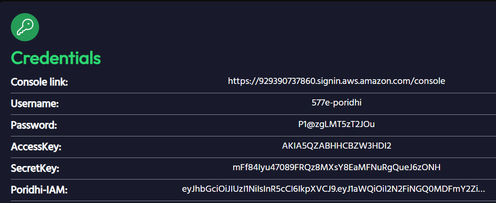
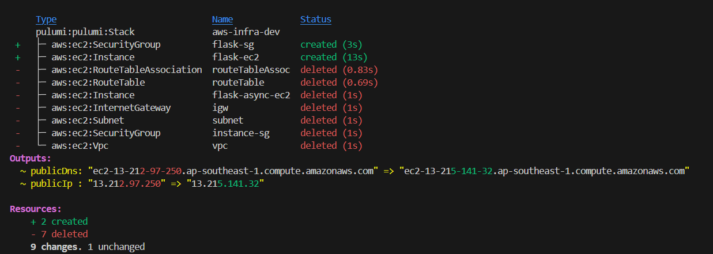
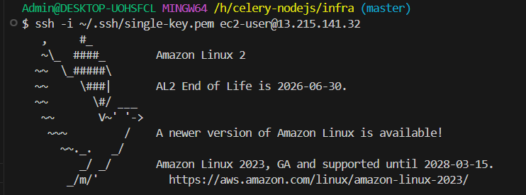

# Async Task Processing System 
This is a hybrid task queue system built using Node.js for the API layer and Celery (Python) for background asynchronous task processing. It is designed to handle computational or I/O-heavy jobs off the main request/response lifecycle using a microservice-based architecture with message brokering and containerized deployment via Docker and Docker Compose.

1. **Nodejs**
-Acts as the frontend-facing REST API that handles HTTP requests and triggers background tasks by sending them to the message broker (RabbitMQ or Redis).
2. **RabbitMQ**
-Serves as the message broker between Node.js and Celery. It queues the tasks and delivers them reliably to Celery workers. RabbitMQ is feature-rich; Redis is faster for lightweight use cases.
3. **Celery-Worker**
-Consumes tasks from the message broker and executes long-running or asynchronous tasks (e.g., sending emails, processing data) in the background.

4. **Redis**
-Optionally used for Celery result backend, storing task status and results so that the API can later retrieve them if needed.
5. **Flower**
-A web-based tool for monitoring Celery tasks. It provides real-time insights into task execution, queues, retries, and failures.
# Project Overview
This project decouples heavy or blocking operations (like sending emails or batch processing data) from the main web server using an asynchronous task queue.
# Project Structure
```bash
CELERY-NODEJS/
│
├── api/                        # Node.js backend service
│   ├── src/
│   │   ├── controllers/        # Route controllers (e.g., taskController.js)
│   │   ├── middleware/         # Error handling middleware
│   │   ├── routes/             # API route definitions
│   │   ├── services/           # Business logic layer
│   │   ├── utils/              # Utility functions (e.g., logger)
│   │   └── app.js              # Express app entry point
│   ├── .env                    # Node environment variables
│   ├── Dockerfile              # Dockerfile for Node.js app
│   ├── package.json            # Node.js project config
│
├── worker/                     # Python Celery worker
│   ├── tasks/
│   │   ├── __init__.py
│   │   ├── celery_app.py       # Celery configuration
│   │   └── task_definitions.py # Task function definitions
│   ├── venv/                   # Python virtual environment (optional, use Docker ideally)
│   ├── requirements.txt        # Python dependencies
│   ├── Dockerfile              # Dockerfile for Python worker
│   ├── .env                    # Environment for Celery
│
├── docker-compose.yml          # Compose file to run services
├── .gitignore
└── README.md                   # Project overview and usage docs
```
# Project Architecture

# Set-up Instructions
1. **Clone the repo**
```bash
git clone https://github.com/Towshin05/Celery_Async_task.git

cd  CELERY_NODEJS
```
2. **Start all services**
```bash
docker-compose up --build
```

##  URLs & Ports

| Service        | URL                                              |
| -------------- | ------------------------------------------------ |
| Nodejs       | [http://localhost:5000](http://localhost:3000)   |
| RabbitMQ Admin | [http://localhost:15672](http://localhost:15672) |
| Flower Monitor | [http://localhost:5555](http://localhost:5555)   |


# API Curl
1. **Add Numbers**
```bash
curl -X POST http://localhost:3000/api/tasks \
-H "Content-Type: application/json" \
-d '{"task_name": "add_numbers", "args": [5, 10]}'
```
2. **Process_data**
```bash
curl -X POST http://localhost:3000/api/tasks \
-H "Content-Type: application/json" \
-d '{"task_name": "process_data", "args": ["hello", 2]}'
```
3. **Send Email**
```bash
curl -X POST http://localhost:3000/api/tasks \
-H "Content-Type: application/json" \
-d '{"task_name": "send_email", "args": ["user@example.com", "Hi", "Hello there."]}'
```

4. **Failing Task**
```bash
curl -X POST http://localhost:3000/api/tasks \
-H "Content-Type: application/json" \
-d '{"task_name": "failing_task", "args": [true]}'
```
5. **Batch Process**
```bash
curl -X POST http://localhost:3000/api/tasks \
-H "Content-Type: application/json" \
-d '{"task_name": "batch_process", "args": [["apple", "banana", "carrot"]]}'
```


### Monitoring with Flower
-After running docker-compose up, visit: http://localhost:5555
 


### RabbitMQ Management UI
Default credentials: guest/guest
-Monitor queues, exchanges, and connections


## Poridhi Lab Setup
1. Create load balancer and configure with your application's IP and port in Poridhi lab:


2. Configure IP and port:
- Get IP from eth0 using `ifconfig`

<div align="center">
  
</div>

- Use application port from Dockerfile


3. Access the application through load balancer:
At first we load the system following the instructions as in local machine and checking if all the ports are forwarded.
<div align="center">
  
</div>

# Asynchronous Task Processing System using Pulumi-AWS Single-EC2 Deployment.
## Project Overview
The objective of this project is to develop a scalable, asynchronous task management system using Node.js, Celery, RabbitMQ, Flower, and Redis. The system will allow for the execution of background tasks in an asynchronous manner, with real-time monitoring, task queuing, and persistent storage of task results.
## Project Structure
```bash
infra/
├── node_modules
├── .gitignore
├── pnpm-lock.yaml
├── index.js               # Pulumi AWS EC2 provision code
├── Pulumi.yaml
├── Pulumi.dev.yaml
└── .env                   # optional: environment variables
```
## Prerequisites
- AWS CLI configured
- Pulumi CLI installed
- Docker & Docker Compose installed
- A valid AWS EC2 key pair (e.g., key-pair-multi)
- Pulumi account set up (pulumi login)
- Docker Running

```bash
#Nodejs 
sudo apt update
sudo apt install nodejs
sudo apt install npm

#Python and celery
sudo apt update
sudo apt install python3 python3-pip
pip3 install celery
#Redis
sudo apt update
sudo apt install redis-server

```

1. At First from the lab generate the Credentials get the access ID and Secret keys.


2. AWS Configuration from the terminal:


3. Initialize Pulumi Project
```bash
cd infra
pulumi new aws-javascript
pulumi config set aws:region ap-southeast-1
```
**Respond to prompts:**

- Project name: infra
- Stack: dev (can create your new stack with name of desired)
- AWS region: ap-southeast-1
- json: json

4. The **index.js** file:
**key-name.pem** must be present in the working folder.
```bash
const aws = require("@pulumi/aws");

const keyName = "single-key"; // Your EC2 key pair name (NOT .pem file)

const sg = new aws.ec2.SecurityGroup("flask-sg", {
    description: "Allow SSH and Flask port",
    ingress: [
        { protocol: "tcp", fromPort: 22, toPort: 22, cidrBlocks: ["0.0.0.0/0"] },    // SSH
        { protocol: "tcp", fromPort: 5000, toPort: 5000, cidrBlocks: ["0.0.0.0/0"] } // Flask
    ],
    egress: [
        { protocol: "-1", fromPort: 0, toPort: 0, cidrBlocks: ["0.0.0.0/0"] }
    ]
});

const ami = aws.ec2.getAmi({
    filters: [
        { name: "name", values: ["amzn2-ami-hvm-*-x86_64-gp2"] },
        { name: "virtualization-type", values: ["hvm"] }
    ],
    owners: ["137112412989"],
    mostRecent: true
});

const server = ami.then(image => new aws.ec2.Instance("flask-ec2", {
    instanceType: "t2.micro",
    ami: image.id,
    keyName: keyName,
    vpcSecurityGroupIds: [sg.id],
    userData: `#!/bin/bash
yum update -y
yum install -y docker git
systemctl start docker
usermod -aG docker ec2-user
cd /home/ec2-user
git clone https://github.com/Towshin05/Celery_Async_task.git
cd Celery_Async_task
docker-compose --profile flask up -d
`,
    tags: { Name: "flask-ec2" }
}));

exports.publicIp = server.then(instance => instance.publicIp);
exports.publicDns = server.then(instance => instance.publicDns);


```

5. Run the pulumi project
```bash
pulumi up
```


6. SSH Into EC2 and Set Up Dockerized Project
```bash

ssh -i ~/.ssh/single-key.pem ec2-user@<public-ip>
```



7. Install Docker Compose v2
```bash
sudo curl -L "https://github.com/docker/compose/releases/download/v2.24.7/docker-compose-$(uname -s)-$(uname -m)" -o /usr/local/bin/docker-compose
#make it executable
sudo chmod +x /usr/local/bin/docker-compose
#verify
docker-compose version

```
8. Start the app
```bash
docker-compose up -d
#to check
docker ps
```
9. Clear 
```bash
pulumi destroy
```

# Asynchronous Task Processing System using Pulumi-AWS Multi-EC2 Deployment.
 ## Project Overview
This project deploys a distributed system composed of:

- Node.js: Main backend API service
- Python Celery workers: Task processors
- RabbitMQ: Message broker
- Redis: Celery result backend
- Flower: Real-time monitoring UI for Celery
- Pulumi: Infrastructure as Code (IaC) for provisioning AWS EC2 instances and networking
- Docker Compose: Used to run containers on the EC2 instance.

## Project Structure
```bash
multi-infra/
├── docker-compose.yml
├── Dockerfile.nodejs
├── Dockerfile.worker
├── index.js               # Pulumi AWS EC2 provision code
├── Pulumi.yaml
├── Pulumi.dev.yaml
└── .env                   # optional: environment variables
```

## Prerequisites
- AWS CLI configured
- Pulumi CLI installed
- Docker & Docker Compose installed
- A valid AWS EC2 key pair (e.g., key-pair-multi)
- Pulumi account set up (pulumi login)

## Deploy with Pulumi

```bash
# Login to Pulumi (first time only)
pulumi login

# Create a new Pulumi stack
pulumi stack init dev

# (Optional) Set AWS region
pulumi config set aws:region ap-southeast-1


```
**This file automatically:**
- Creates Security Group (open ports: 22, 3000, 5555, 15672, etc.)
- Provisions 6 EC2 instances
- Installs Docker & Docker Compose
- Clones your repo
- Runs Docker Compose on each instance

Add this to **index.js** file 
```bash
const aws = require("@pulumi/aws");

// 🔧 Replace with your actual EC2 key pair name (.pem file)
const keyName = "key-pair-multi"; // <-- Replace this

function createInstance(name, profile, ports) {
    const sg = new aws.ec2.SecurityGroup(`${name}-sg`, {
        description: `Security Group for ${name}`,
        ingress: ports.map(p => ({
            protocol: "tcp",
            fromPort: p,
            toPort: p,
            cidrBlocks: ["0.0.0.0/0"],
        })),
        egress: [{
            protocol: "-1",
            fromPort: 0,
            toPort: 0,
            cidrBlocks: ["0.0.0.0/0"],
        }],
    });

    return aws.ec2.getAmi({
        filters: [
            { name: "name", values: ["amzn2-ami-hvm-*-x86_64-gp2"] },
            { name: "virtualization-type", values: ["hvm"] },
        ],
        owners: ["137112412989"],
        mostRecent: true,
    }).then(ami => new aws.ec2.Instance(`${name}-ec2`, {
        ami: ami.id,
        instanceType: "t2.micro",
        keyName: keyName,
        vpcSecurityGroupIds: [sg.id],
        userData: `#!/bin/bash
yum update -y
yum install -y docker git
systemctl start docker
usermod -aG docker ec2-user
cd /home/ec2-user
git clone https://github.com/Towshin05/Celery_Async_task.git
cd Celery_Async_task
docker-compose --profile ${profile} up -d
`,
        tags: { Name: `${name}-ec2` },
    }));
}

// Create all 6 EC2 instances
exports.flask = createInstance("flask", "flask", [5000]);
exports.rabbitmq = createInstance("rabbitmq", "rabbitmq", [5672, 15672]);
exports.redis = createInstance("redis", "redis", [6379]);
exports.worker1 = createInstance("worker1", "worker", []);
exports.worker2 = createInstance("worker2", "worker", []);
exports.flower = createInstance("flower", "flower", [5555]);

```

## Create EC2 Key Pair (.pem) File
1. Go to Ec2 through search bar
2. Launch instances.
3. Give a name in the field **Name and tag** 
4. Give appropiate key pair name and choose .pem
5. save it and keep it to the project folder.


1.  For Linux/macOS
```bash
curl "https://awscli.amazonaws.com/awscli-exe-linux-x86_64.zip" -o "awscliv2.zip"
unzip awscliv2.zip
sudo ./aws/install

# Or use package manager:
sudo apt install awscli  # Debian/Ubuntu
brew install awscli      # macOS
```
2. Configure AWS CLI Credentials
This command will prompt to:
```bash
AWS Access Key ID [None]: YOUR_ACCESS_KEY_ID
AWS Secret Access Key [None]: YOUR_SECRET_ACCESS_KEY
Default region name [None]: ap-southeast-1
Default output format [None]: json

```

3. Verify AWS CLI Works
```bash
aws sts get-caller-identity
```

4. Run
 
``` bash
pulumi up
```
5. Termination

```bash
pulumi destroy
```
